# SonicSync Engineering Flowcharts

These are executable decision diagrams, not decorative product diagrams.

## 1. Complete system operation

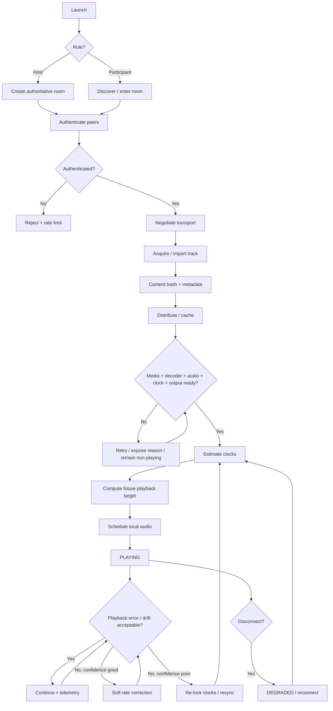

## 2. Host workflow

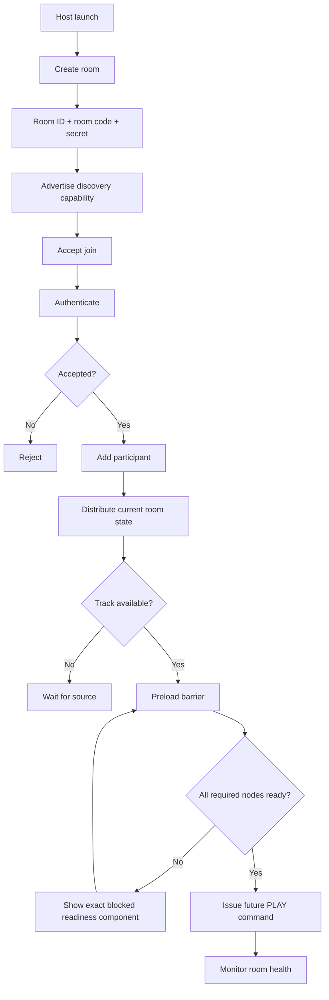

## 3. Participant workflow

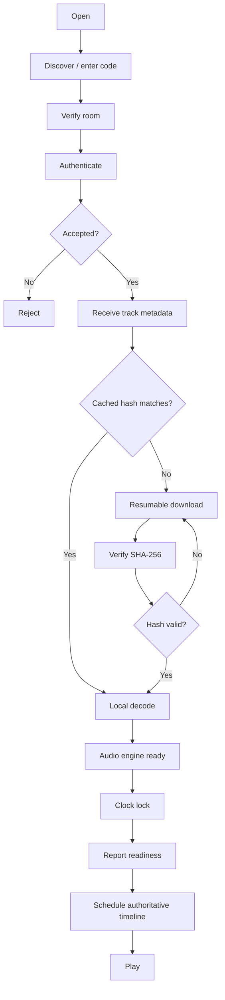

## 4. Room creation / joining

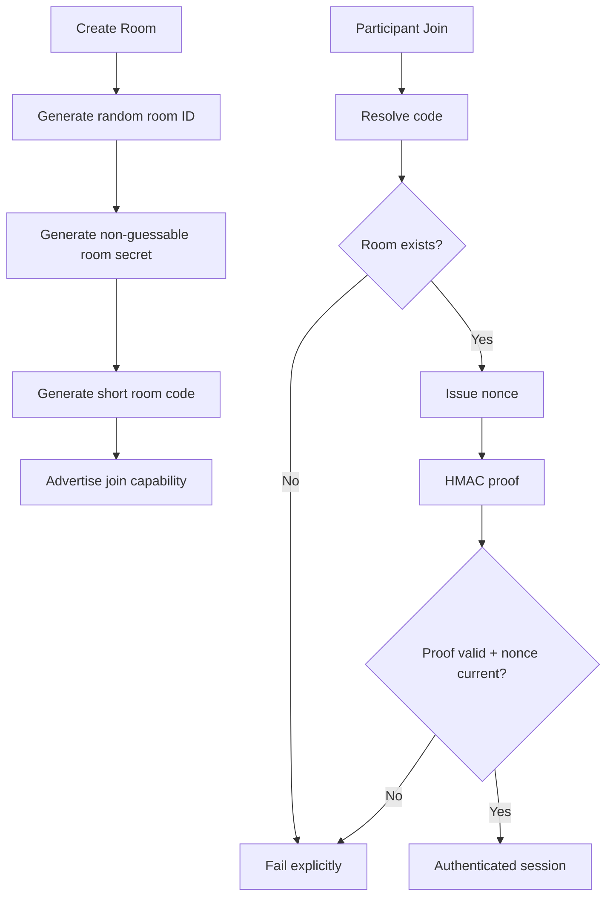

## 5. Device discovery

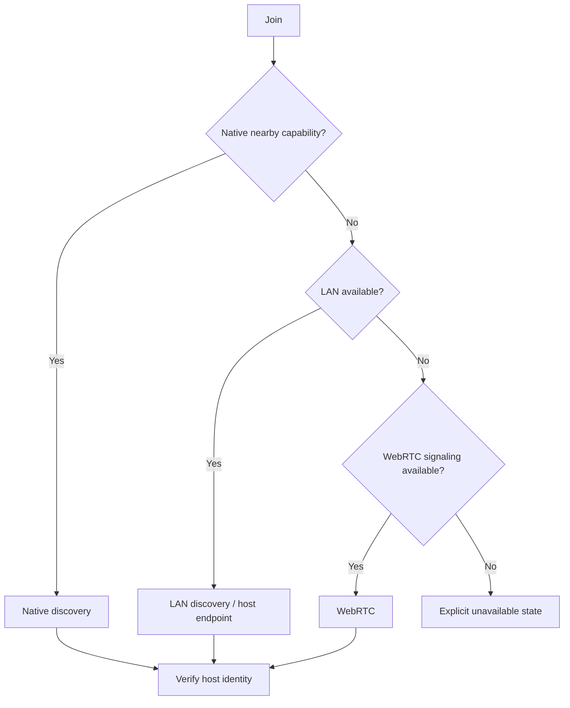

## 6. Authentication / pairing

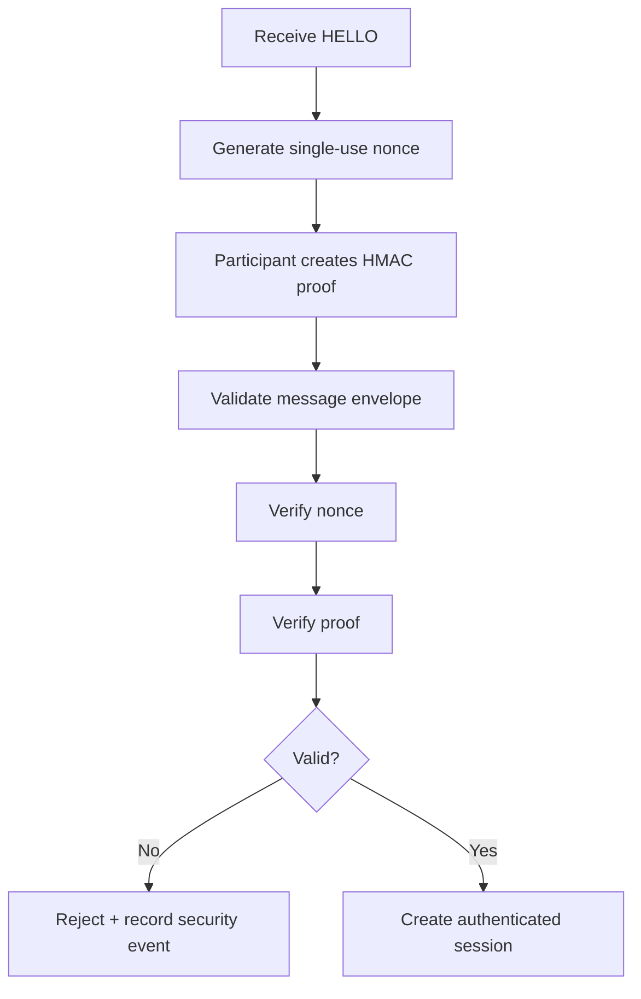

## 7. Audio acquisition

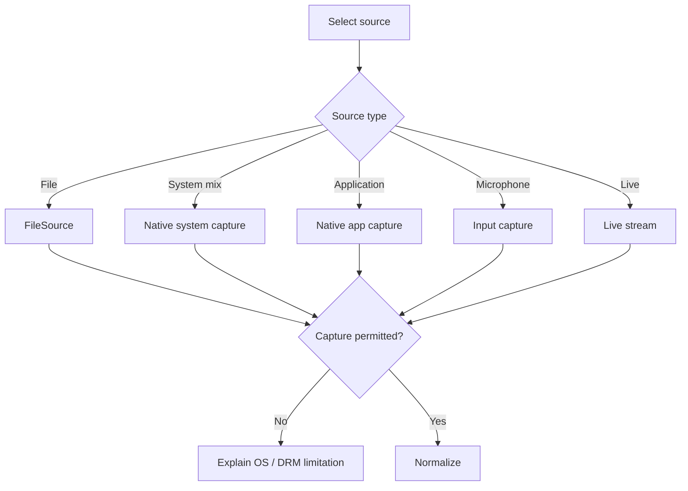

## 8. Audio distribution

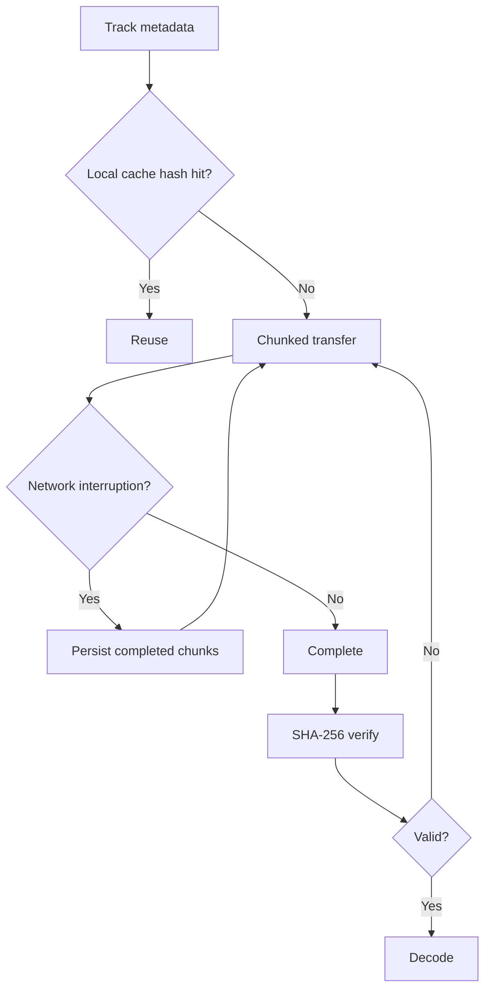

## 9. Buffer / decode

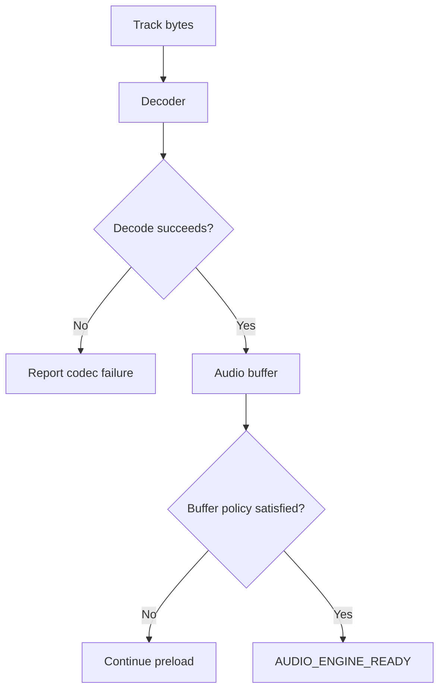

## 10. Clock synchronization

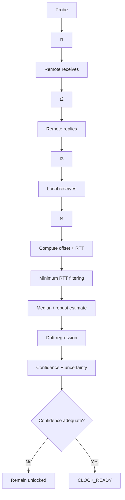

## 11. Playback synchronization

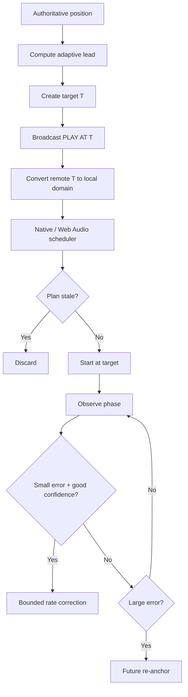

## 12. Pause / resume / seek

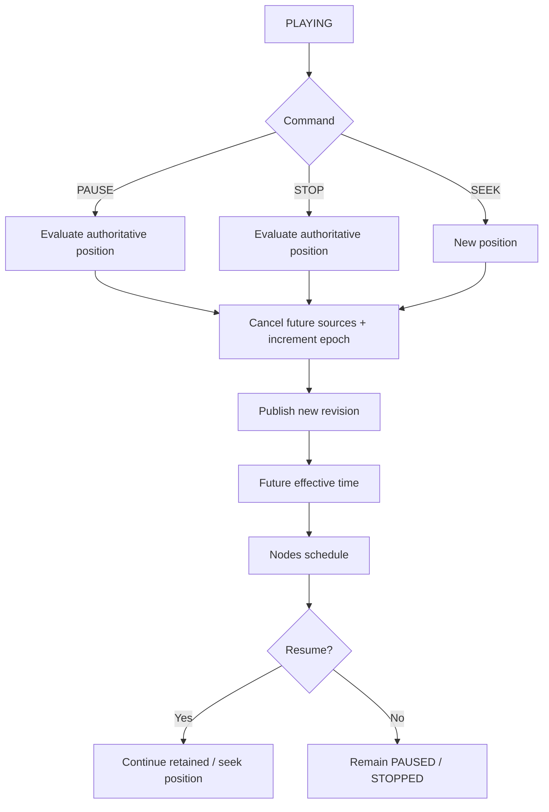

## 13. Late join

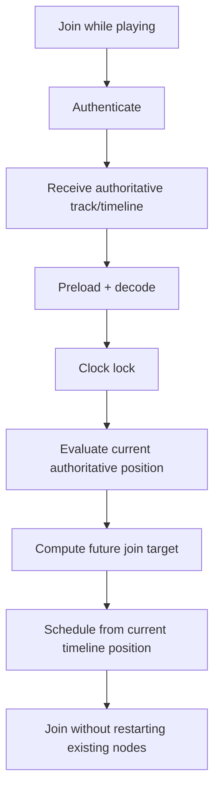

## 14. Reconnect / failure recovery

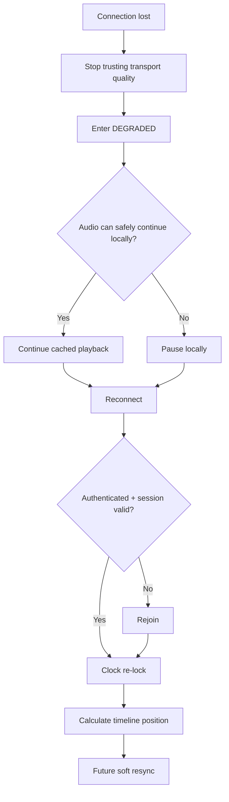

## 15. Hardware speaker-node operation

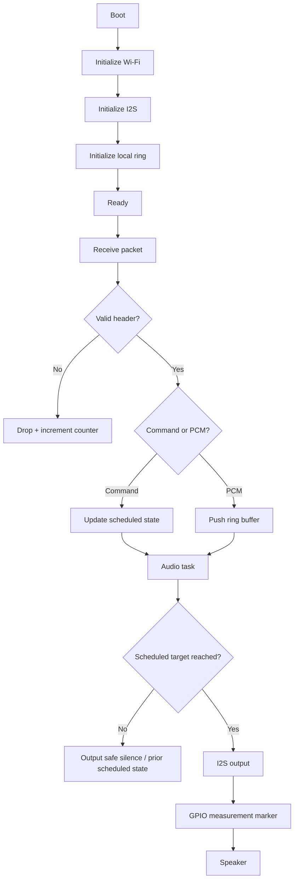

## 16. Calibration / latency measurement

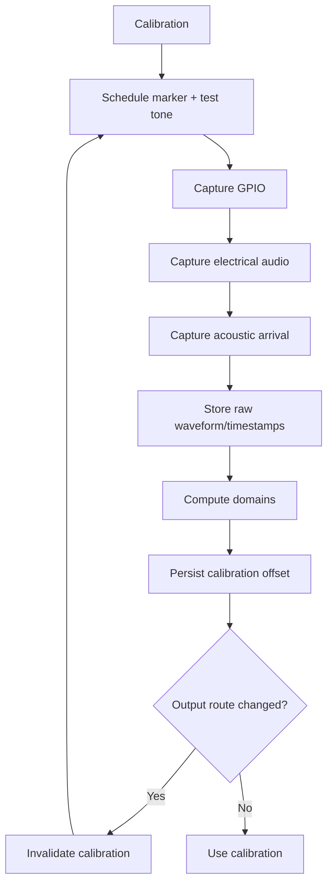
